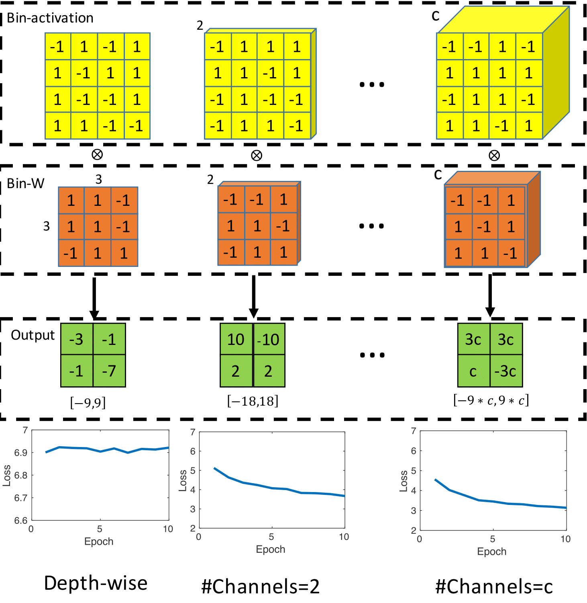
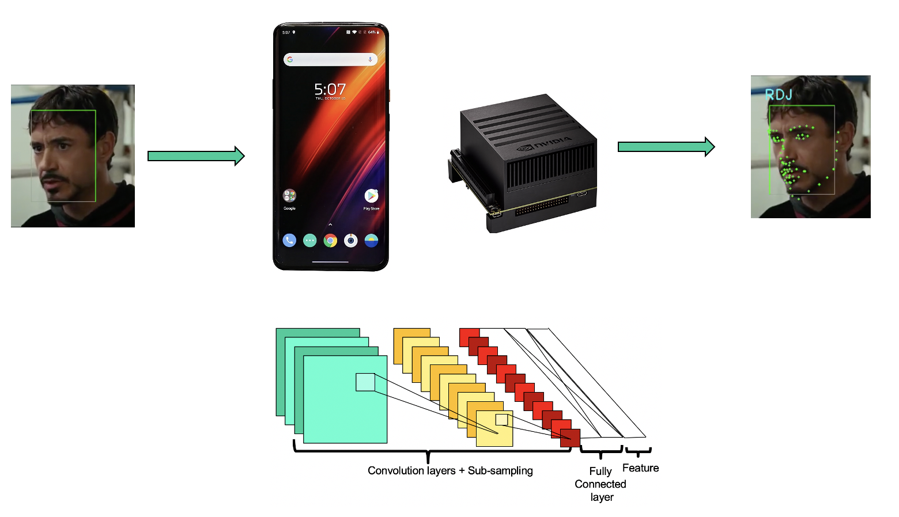
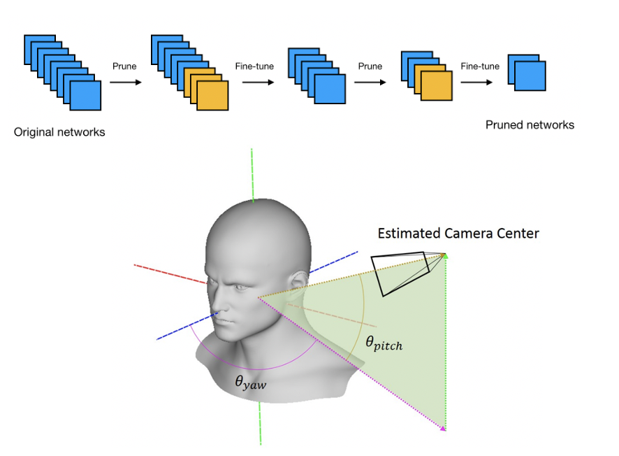
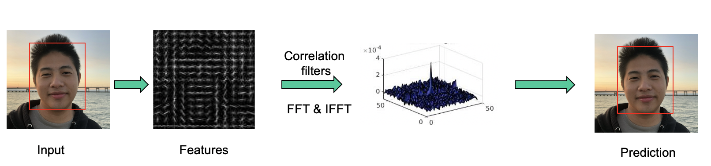
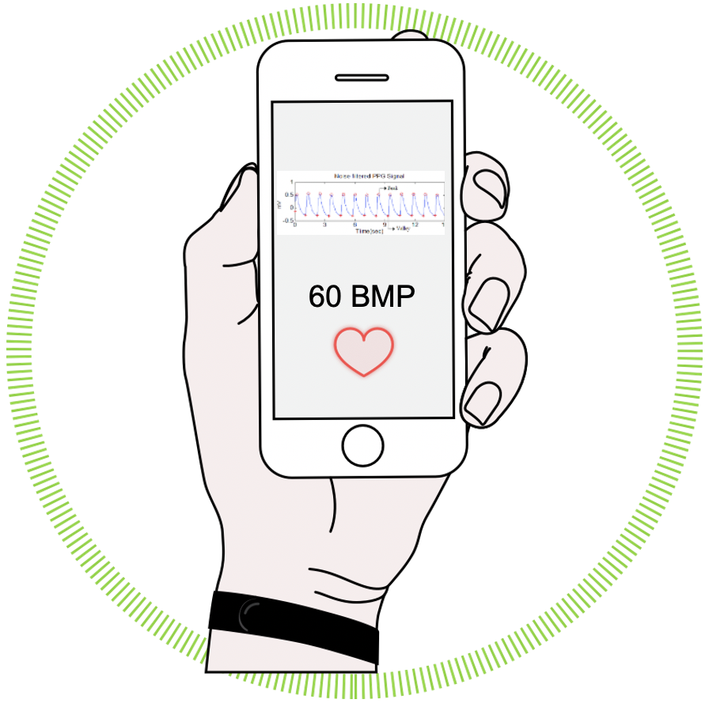
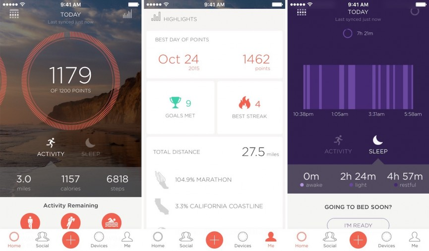
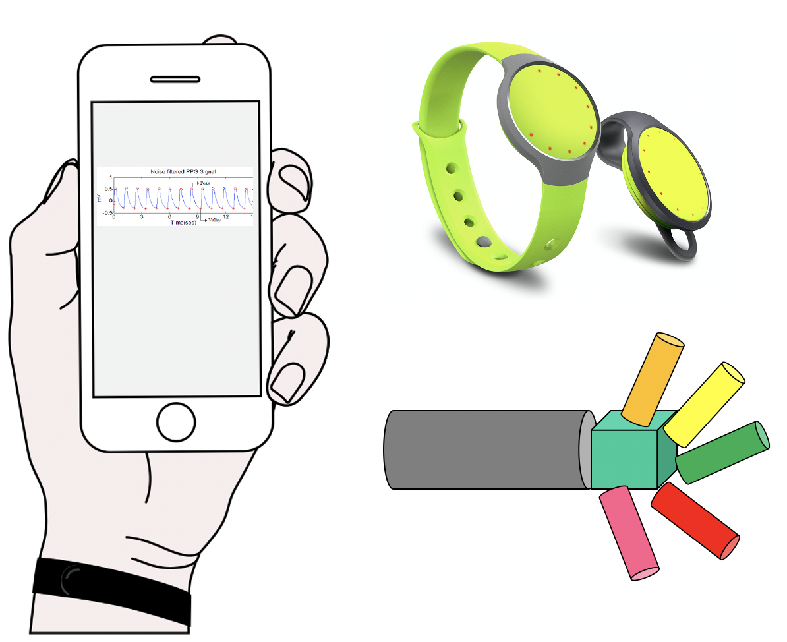
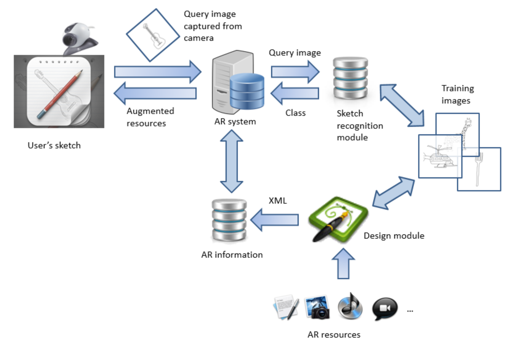
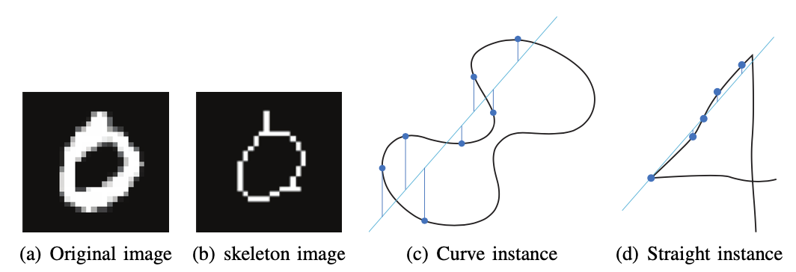

                
                

                    

                        <strong>
                             Binary Neural Networks (BNNs).
                     </strong>
                     <!--   -->
                        <!-- <strong>Yihui He*</strong>, Ji Lin*, Zhijian Liu, Hanrui Wang, Li-Jia Li, <a target="_blank" href="http://songhan.mit.edu">Song Han</a>, <strong>ECCV 2018</strong> -->
                        <!-- <a target="_blank"
                           href="http://openaccess.thecvf.com/content_ECCV_2018/html/Yihui_He_AMC_Automated_Model_ECCV_2018_paper.html">[PDF]</a>  
                         <a target="_blank"
                           href="https://arxiv.org/abs/1802.03494">[arXiv]</a> 
                        <a target="_blank"
                           href="https://github.com/mit-han-lab/amc-compressed-models">[code]</a>  -->
                    

                    

                        Researched and developed binary neural networks for image classification. The papers are publised at CVPR 2020 <a target="_blank" href="https://openaccess.thecvf.com/content_CVPR_2020/papers/Phan_Binarizing_MobileNet_via_Evolution-Based_Searching_CVPR_2020_paper.pdf">[PDF]</a> and WACV 2020 <a target="_blank" href="https://openaccess.thecvf.com/content_WACV_2020/papers/Phan_MoBiNet_A_Mobile_Binary_Network_for_Image_Classification_WACV_2020_paper.pdf">[PDF]</a>. 
                        <u>Languages/Technical usage</u>: Python, Pytorch
                    

                

            

                
                

                    

                        <strong>
                             Efficient Deep Learning for mobile devices.
                     </strong>
                     <!--   -->
                        <!-- <strong>Yihui He*</strong>, Ji Lin*, Zhijian Liu, Hanrui Wang, Li-Jia Li, <a target="_blank" href="http://songhan.mit.edu">Song Han</a>, <strong>ECCV 2018</strong> -->
                        <!-- <a target="_blank"
                           href="http://openaccess.thecvf.com/content_ECCV_2018/html/Yihui_He_AMC_Automated_Model_ECCV_2018_paper.html">[PDF]</a>  
                         <a target="_blank"
                           href="https://arxiv.org/abs/1802.03494">[arXiv]</a> 
                        <a target="_blank"
                           href="https://github.com/mit-han-lab/amc-compressed-models">[code]</a>  -->
                    

                    

                        Researched and developed facial recognition on devices (iPhone/Xavier) on C++ SDK for CMU face matching. Improved the speed of computation <strong>8</strong>x in GPU and achieved <strong>8-10 FPS</strong> on iPhone 7, <strong>125 FPS</strong>, and <strong>20 FPS</strong> on Xavier GP and CPU respectively. 
                        <u>Languages/Technical usage</u>: C++, Python, Pytorch, Caffe, Objective-C, OpenCV
                    

                

            
    

                
                

                    

                        <strong>
                             3D Face Pose Estimation on mobile devices.
                     </strong>
                     <!--   -->
                        <!-- <strong>Yihui He*</strong>, Ji Lin*, Zhijian Liu, Hanrui Wang, Li-Jia Li, <a target="_blank" href="http://songhan.mit.edu">Song Han</a>, <strong>ECCV 2018</strong> -->
                        <!-- <a target="_blank"
                           href="http://openaccess.thecvf.com/content_ECCV_2018/html/Yihui_He_AMC_Automated_Model_ECCV_2018_paper.html">[PDF]</a>  
                         <a target="_blank"
                           href="https://arxiv.org/abs/1802.03494">[arXiv]</a> 
                        <a target="_blank"
                           href="https://github.com/mit-han-lab/amc-compressed-models">[code]</a>  -->
                    

                    

                        Researched and developed 3D facial landmarking for facial alignment on devices (iPhone/Android/Jetson TX) for C++ SDK. To wrap 3D face, we used 3D Thin Plate Spline (TPS) algorithm proposed in  <a target="_blank" href="../assets/pdf/Robust Pose Invariant Face Recognition Using 3D Thin Plate Spline.pdf">Chandrasekhar's thesis</a> to estimate camera parameters through a compressed neural network. The proposed framework achieved Normalized Mean Error of <strong>3</strong>% and about <strong>100 FPS</strong> on single GPU. 
                        <u>Languages/Technical usage</u>: C++, Python, Pytorch, Java, Caffe, Objective-C, OpenCV
                    

                

            
    

                
                

                    

                        <strong>
                             Machine Vision: Object tracking.
                     </strong>
                     <!--   -->
                        <!-- <strong>Yihui He*</strong>, Ji Lin*, Zhijian Liu, Hanrui Wang, Li-Jia Li, <a target="_blank" href="http://songhan.mit.edu">Song Han</a>, <strong>ECCV 2018</strong> -->
                        <!-- <a target="_blank"
                           href="http://openaccess.thecvf.com/content_ECCV_2018/html/Yihui_He_AMC_Automated_Model_ECCV_2018_paper.html">[PDF]</a>  
                         <a target="_blank"
                           href="https://arxiv.org/abs/1802.03494">[arXiv]</a> 
                        <a target="_blank"
                           href="https://github.com/mit-han-lab/amc-compressed-models">[code]</a>  -->
                    

                    

                        Developed real-time correlation filter object tracking C++ library, following movement of people/objects. The algorithm achieved <strong>30 FPS</strong> on iPhone 5,6 with very high accuracy. Thanks to this developement, our Computer Vision team was acquired by Axon Company, a company working on-body camera to provide evidence for polices in US. <a target="_blank"
                           href="https://www.bizjournals.com/phoenix/news/2017/02/09/taser-acquires-two-companies-to-form-new-ai-group.html">[news]</a> 
                        <u>Languages/Technical usage</u>: C++, Objective-C, OpenCV
                    

                

            
    

                
                

                    

                        <strong>
                             Heart rate detection.
                     </strong>
                     <!--   -->
                        <!-- <strong>Yihui He*</strong>, Ji Lin*, Zhijian Liu, Hanrui Wang, Li-Jia Li, <a target="_blank" href="http://songhan.mit.edu">Song Han</a>, <strong>ECCV 2018</strong> -->
                        <!-- <a target="_blank"
                           href="http://openaccess.thecvf.com/content_ECCV_2018/html/Yihui_He_AMC_Automated_Model_ECCV_2018_paper.html">[PDF]</a>  
                         <a target="_blank"
                           href="https://arxiv.org/abs/1802.03494">[arXiv]</a> 
                        <a target="_blank"
                           href="https://github.com/mit-han-lab/amc-compressed-models">[code]</a>  -->
                    

                    

                        Developed non-intrusive heart rate estimation algorithm in C++ library using face/finger video recored by an ordinary camera. The algorithm gives the results within <strong>8-10 seconds</strong> and achieved error rate of <strong>0.5%</strong> comparing to real heart rate monitor in the hospital. This app is deployed on Misfit production release and used by thousands of users. 
                        <u>Languages/Technical usage</u>: C++, Objective-C, OpenCV
                    

                

            
    

                
                

                    

                      <strong>
                             iOS Misfit App.
                      </strong>
                     <!--   -->
                        <!-- <strong>Yihui He*</strong>, Ji Lin*, Zhijian Liu, Hanrui Wang, Li-Jia Li, <a target="_blank" href="http://songhan.mit.edu">Song Han</a>, <strong>ECCV 2018</strong> -->
                        <!-- <a target="_blank"
                           href="http://openaccess.thecvf.com/content_ECCV_2018/html/Yihui_He_AMC_Automated_Model_ECCV_2018_paper.html">[PDF]</a>  
                         <a target="_blank"
                           href="https://arxiv.org/abs/1802.03494">[arXiv]</a> 
                        <a target="_blank"
                           href="https://github.com/mit-han-lab/amc-compressed-models">[code]</a>  -->
                    

                    

                        Developed iOS Misfit app used by millions of users worldwide. 
                        <u>Languages/Technical usage</u>: Bluetooth Low Engergy (BLE), Objective-C
                    

                

            
    

                
                

                    

                      <strong>
                             Data sensor streaming.
                      </strong>
                     <!--   -->
                        <!-- <strong>Yihui He*</strong>, Ji Lin*, Zhijian Liu, Hanrui Wang, Li-Jia Li, <a target="_blank" href="http://songhan.mit.edu">Song Han</a>, <strong>ECCV 2018</strong> -->
                        <!-- <a target="_blank"
                           href="http://openaccess.thecvf.com/content_ECCV_2018/html/Yihui_He_AMC_Automated_Model_ECCV_2018_paper.html">[PDF]</a>  
                         <a target="_blank"
                           href="https://arxiv.org/abs/1802.03494">[arXiv]</a> 
                        <a target="_blank"
                           href="https://github.com/mit-han-lab/amc-compressed-models">[code]</a>  -->
                    

                    

                        Developed an API to stream data to record human activities. Calibration data are obtained through sensors: Gyroscope, Accelerometer, and Magnetometer. The streaming process can last each to <strong>16 hours</strong> and data are pushed on server through a Misfit Web API. In addition, stream data is uused to simluate 3D human body in the sport for research. 
                        <u>Languages/Technical usage</u>: Bluetooth Low Engergy (BLE), Objective-C
                    

                

            
    

                
                

                    

                      <strong>
                             Sketch recognition for augumented reality application.
                      </strong>
                     <!--   -->
                        <!-- <strong>Yihui He*</strong>, Ji Lin*, Zhijian Liu, Hanrui Wang, Li-Jia Li, <a target="_blank" href="http://songhan.mit.edu">Song Han</a>, <strong>ECCV 2018</strong> -->
                        <!-- <a target="_blank"
                           href="http://openaccess.thecvf.com/content_ECCV_2018/html/Yihui_He_AMC_Automated_Model_ECCV_2018_paper.html">[PDF]</a>  
                         <a target="_blank"
                           href="https://arxiv.org/abs/1802.03494">[arXiv]</a> 
                        <a target="_blank"
                           href="https://github.com/mit-han-lab/amc-compressed-models">[code]</a>  -->
                    

                    

                        Researched and developed sketch recognition algorithm for augumented reality to help people interact with drawing. My report: <a target="_blank"
                           href="../assets/pdf/Hai-Huy-Thesis.pdf">[PDF]</a> 
                        <u>Languages/Technical usage</u>: C++, Support Vector Machine Liblinear, <a target="_blank"
                           href="https://www.vlfeat.org/">VLFeat</a> , Matlab
                    

                

            
    

                
                

                    

                      <strong>
                             Hand written recognition using Sparse Auto-Encoder.
                      </strong>
                     <!--   -->
                        <!-- <strong>Yihui He*</strong>, Ji Lin*, Zhijian Liu, Hanrui Wang, Li-Jia Li, <a target="_blank" href="http://songhan.mit.edu">Song Han</a>, <strong>ECCV 2018</strong> -->
                        <!-- <a target="_blank"
                           href="http://openaccess.thecvf.com/content_ECCV_2018/html/Yihui_He_AMC_Automated_Model_ECCV_2018_paper.html">[PDF]</a>  
                         <a target="_blank"
                           href="https://arxiv.org/abs/1802.03494">[arXiv]</a> 
                        <a target="_blank"
                           href="https://github.com/mit-han-lab/amc-compressed-models">[code]</a>  -->
                    

                    

                        Researched and developed Hand written recognition algorithm . The papers are published at ISPA 2013: <a target="_blank"
                           href="../assets/pdf/Hierarchical_Sparse_Autoencoder_Using_Linear_Regression-based_Features_in_Clustering_for_Handwritten_Digit_Recognition.pdf">[PDF]</a> and book chapter of Issues and Challenges of Intelligent Systems and Computational Intelligence: <a target="_blank"
                           href="../assets/pdf/2014_Book_IssuesAndChallengesOfIntellige.pdf">[PDF]</a>  
                        <u>Languages/Technical usage</u>: C++, Support Vector Machine Liblinear , Matlab
                    

                

            
    